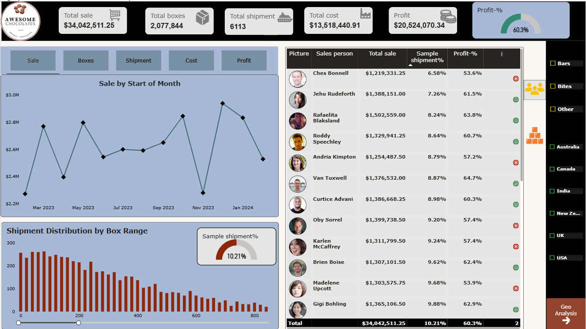
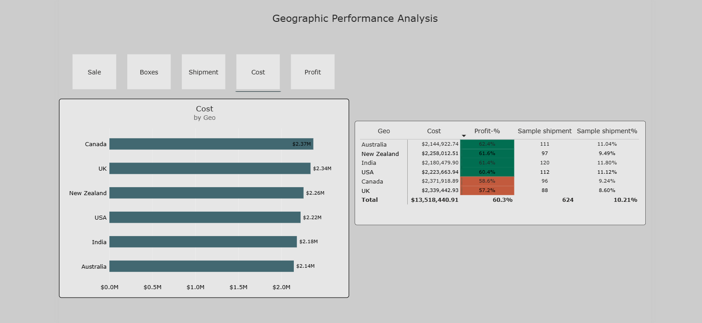

# 🍫 Chocolate Sales Analysis in Power BI

## 📊 Project Overview

This project analyzes chocolate sales data using **Power BI** to understand sales performance, profitability, shipments, products, salespeople, and geographic performance.

An interactive Power BI dashboard was created to transform sales data into meaningful business insights and help identify trends and areas of strong and weak performance.

## 🎯 Project Objective

The main objective of this project is to:

* Analyze overall sales and profit performance
* Track shipments and boxes sold
* Understand monthly sales trends
* Compare product performance
* Analyze salesperson performance
* Understand geographic sales performance
* Monitor profit percentage against the target
* Provide interactive analysis using Power BI

## 🛠️ Tools & Technologies

* **Power BI** – Data modeling, DAX, calculations, and dashboard creation
* **Microsoft Excel** – Source data
* **DAX** – Measures and time-intelligence calculations

## 📁 Dataset

The dataset contains information related to chocolate product sales, shipments, salespeople, products, and geographic locations.

The main tables used in the Power BI data model are:

* **Shipment** – Salesperson, geography, product, date, sales, and boxes
* **Product** – Product, category, and cost per box
* **People** – Salesperson, team, and salesperson image
* **Locations** – Geography and region
* **Calender** – Date and calendar-related information

  ## 📸 Dashboard Preview

### Page 1 – Executive Dashboard

### Page 2 – Geographic Performance Analysis

## 📌 Key KPIs

The dashboard tracks the following key performance indicators:

* **Total Sales**
* **Total Boxes**
* **Total Shipments**
* **Total Cost**
* **Total Profit**
* **Profit Percentage**

## 📊 Power BI Dashboard

The dashboard provides an interactive view of chocolate sales performance with:

* KPI cards for overall business performance
* Dynamic metric selection using a **Field Parameter**
* Monthly trend analysis
* Shipment analysis using box-size bins
* Category and geography slicers
* Product performance analysis
* Salesperson performance analysis
* Profit percentage indicators
* Interactive country-level tooltip analysis
* Bookmarks for interactive navigation
* Custom report-page tooltip showing country-wise contribution and percentage for the selected metric and month

 ## 📌 Overall Summary

The Chocolate Sales Analysis provides an interactive view of sales and profitability performance using Power BI.

The business generated $34.04M in total sales, with $13.52M in total cost and approximately $20.52M in profit. The overall profit percentage was approximately 60%, which is close to the 60% target.

The analysis compares performance across products, salespeople, shipments, countries, categories, and months to identify strong and weak areas of the business.

## 💡 Key Insights

### 🍫 Product Performance

- Peanut Butter Cube had the highest profit percentage at 87.1% with $2.03M in sales.

- 99% Dark & Pure achieved a 74% profit percentage, above the 60% target.

- Organic Choco Syrup had the highest sales at $2.11M, but its 57.3% profit percentage was below the 60% target.

- Baker's Choco Chips had the lowest profit percentage at 17.4%, despite generating $1.47M in sales.

- Milk Bar had the highest sample shipment percentage at 16.49%, based on the 50-box sample shipment threshold.

- Overall, high sales did not always result in high profitability.

### 👤 People Performance

- Kelci Walkden generated the highest sales at $1.52M, with a 65.1% profit percentage, above the 60% target.

- Ches Bonnell had the lowest sales at $1.22M, the lowest profit percentage at 53.6%, and the lowest sample shipment percentage at 6.58%.

- Marney O Breen achieved the highest profit percentage at 66.7%, with $1.33M in sales.

### 📦 Shipment Analysis

- The 80–99 box range had the highest number of shipments, with 263 shipments.

- Very large shipments above 2,500 boxes were relatively uncommon.

### 🌎 Country Performance

- New Zealand generated the highest sales at $5.9M, with a 61.6% profit percentage, above the 60% target.

- Canada had the highest box volume at 364,419 boxes and the highest number of shipments at 1,039.

- Australia achieved the highest profit percentage at 62.4%, above the 60% target.

### 📅 Monthly Performance

- December 2023 recorded the highest monthly sales at $2.93M.

- February 2023 recorded the lowest monthly sales at $2.27M.

### 💼 Business Recommendations

- Focus on high-profit products such as Peanut Butter Cube and 99% Dark & Pure.

- Review the pricing or cost structure of Baker's Choco Chips, which has a 17.4% profit percentage.

- Improve the profitability of high-sales products such as Organic Choco Syrup, which is below the 60% target.

- Support lower-performing salespeople such as Ches Bonnell by reviewing sales and profitability performance.

- Study strong-performing markets such as New Zealand and Australia to identify opportunities for growth.

- Monitor monthly performance and investigate weaker periods such as February 2023.

- Continue tracking performance against the 60% profit target across products, people, and countries.

## ✅ Conclusion

This project demonstrates how Power BI can be used to analyze sales, profitability, products, people, shipments, countries, and monthly performance through an interactive dashboard.

The analysis identified strong-performing products and markets, as well as areas where profitability and sales performance can be improved. The dashboard provides a simple way for business users to monitor key metrics and support data-driven decisions.
